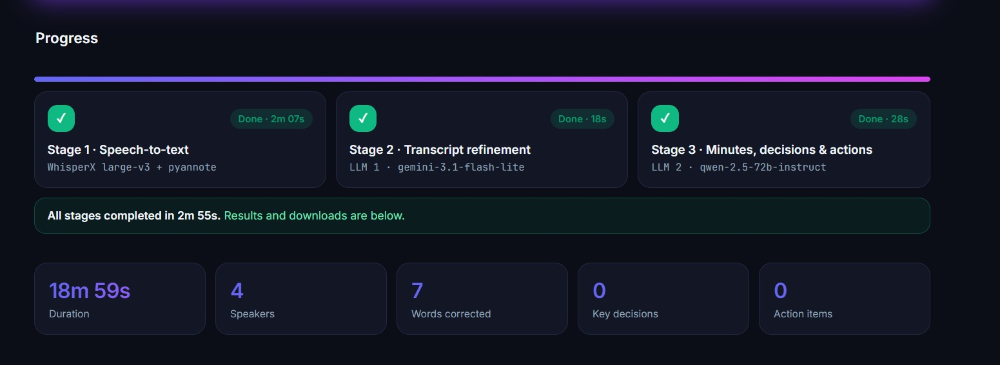

# 🎙️ Meeting Assistant: audio → transcript → minutes, decisions, action items

The whole app runs in this notebook: three model stages plus an interactive web interface.

| Stage | Model | Role |
|---|---|---|
| 1. Speech-to-text | **WhisperX** (Whisper `large-v3` + wav2vec2 alignment + pyannote diarization) | Raw transcript with speakers and timestamps |
| 2. Refinement (LLM 1) | **Gemini 3.1 Flash Lite** via LangChain | Fixes recognition errors in names, terms and acronyms using context, without adding content |
| 3. Meeting record (LLM 2) | **Qwen 2.5 72B Instruct** via OpenRouter | Minutes, key decisions and action items as Pydantic-validated JSON |

## How to run
1. **Runtime → Change runtime type → T4 GPU** (or any GPU) → Save.
2. Put your **OpenRouter API key** and other keys (GEMINI_API_KEY and HF_TOKEN) in the config cell (`OPENROUTER_API_KEY = "sk-or-..."`), or add it in Colab Secrets (🔑 on the left) as `OPENROUTER_API_KEY`. Stage 3 needs it.
3. **Runtime → Run all**.
4. The last cell shows the app and a public link like `https://xxxx.gradio.live`. Open it, upload a recording, press **Start processing**.

The first run installs packages and downloads the speech models, so it takes a few minutes. The first time, the install cell **restarts the session by itself** (Colab may say the session crashed; that is expected). Then click **Runtime → Run all** again and it runs straight through.

Examples:

